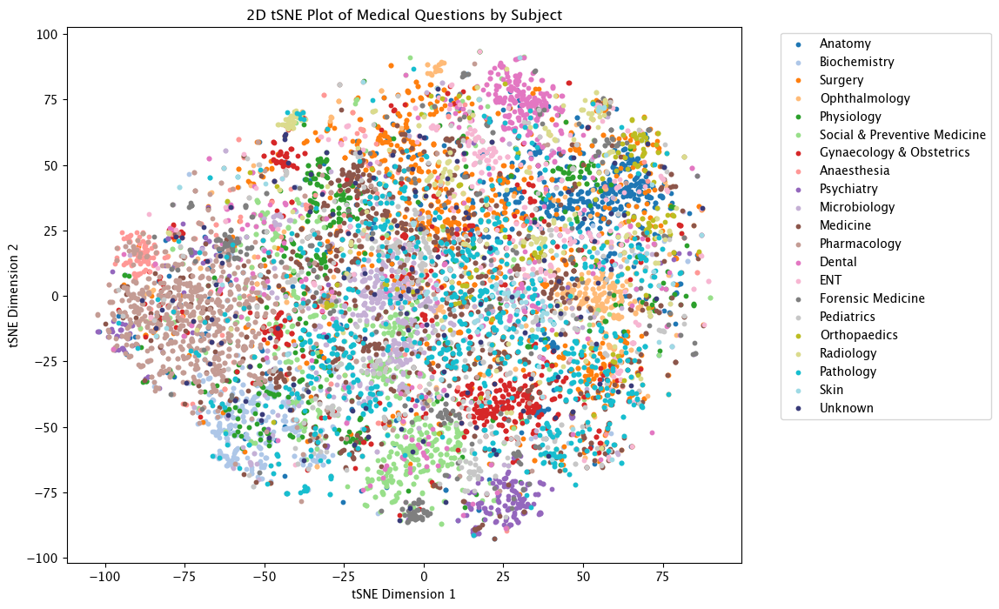
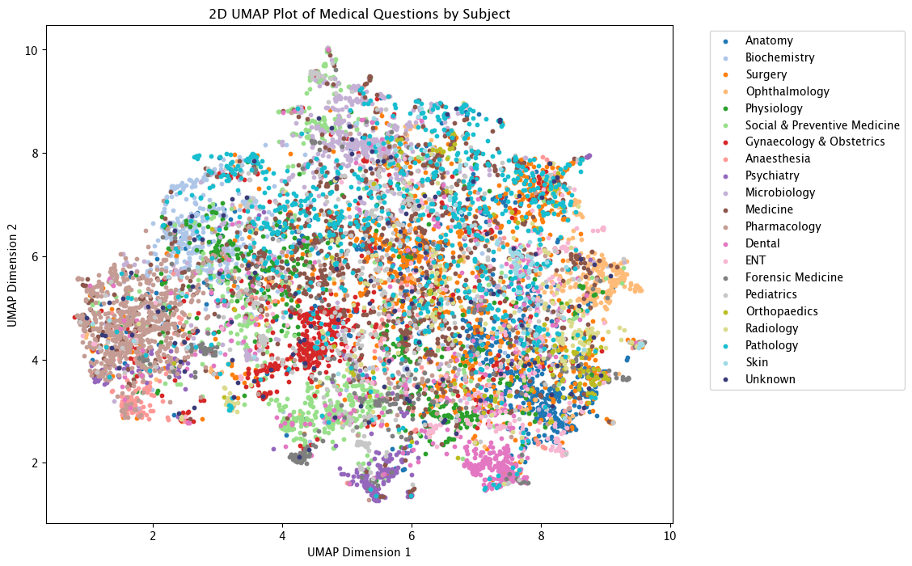
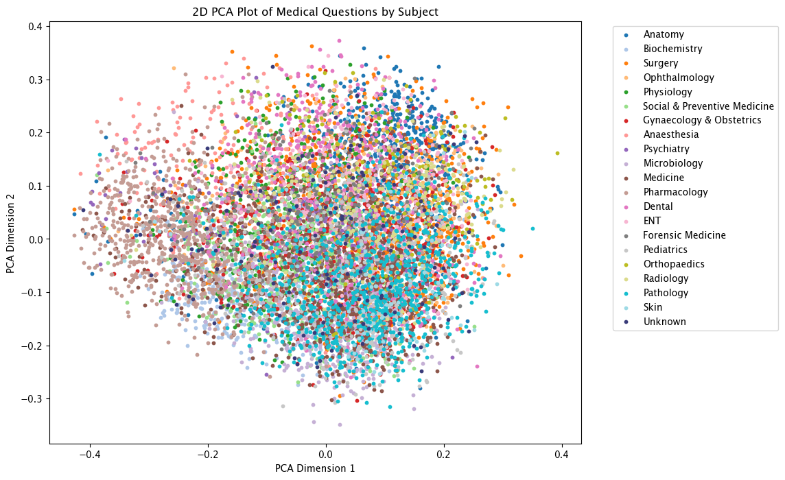

## XAI In LLMs

### Introduction
This notebook uses the MedEmbed-small-v0.1 model found on MTEB and runs tSNE, UMAP and PCA to visualize the embedding space of the model. 
The goal of these visualizations is to see if we can derive relationships between the questions being asked in medical entrance exams and their corresponding subfield of study. 
The MedEmbed model is a family of embedding models fine-tuned specifically for medical and clinical data, designed to enhance performance in healthcare-related natural 
language processing (NLP) tasks, particularly information retrieval (Balachandran). The dataset used to create the embeddings is OpenLifeScienceAI's medmcqa dataset. This dataset 
consists of medical entrance exam questions and answers for a variety of different subfields of medicine.

*Note: 3D Examples are located under the 3D_Graphs folder each an individual html file corresponding to the method used*

## 2D Examples
### tSNE

### UMAP

### PCA

